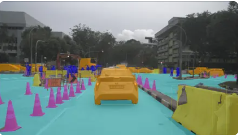
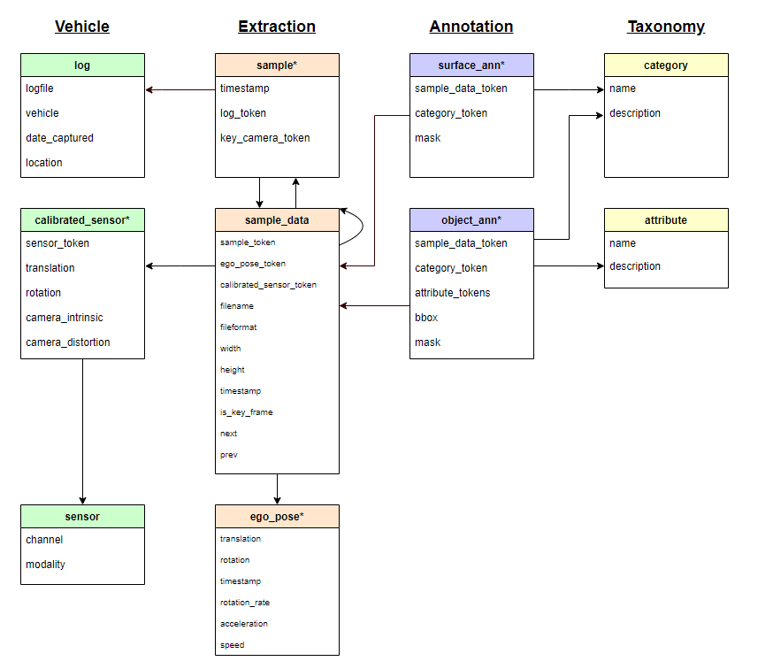
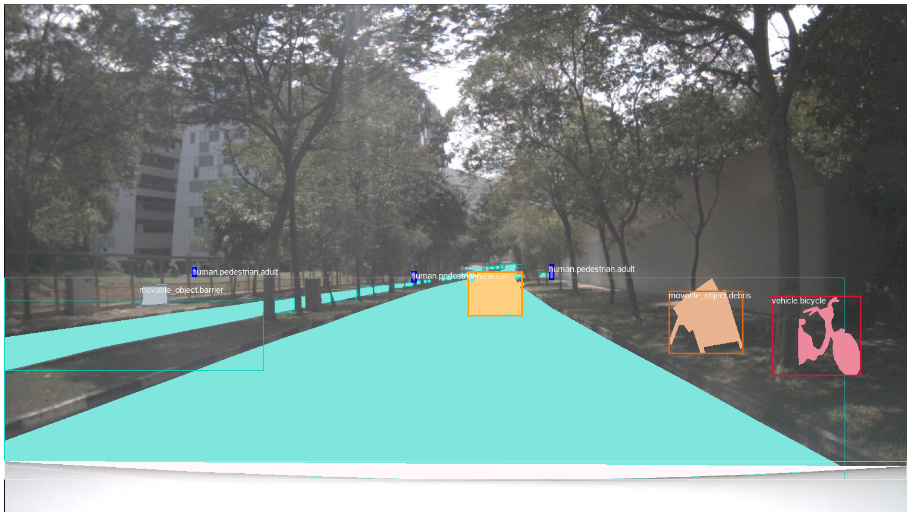
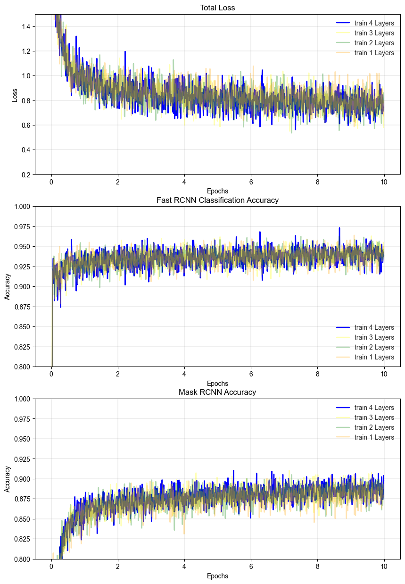
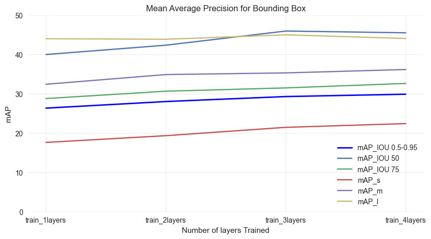
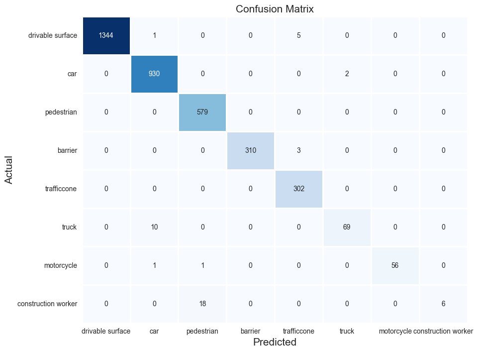
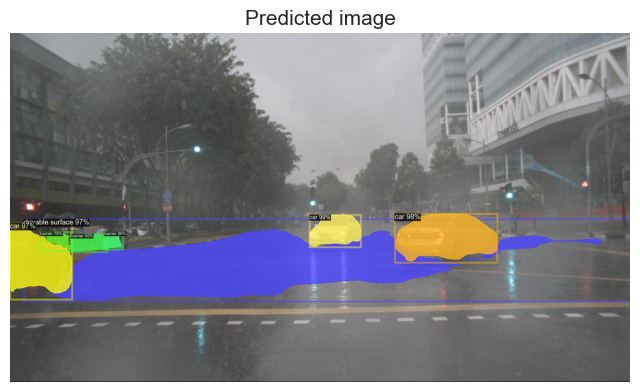
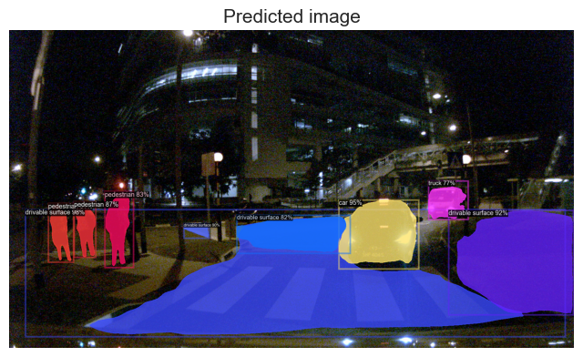

# RoadObjectDetection
Road object detection project using [Detectron 2](https://github.com/facebookresearch/detectron2).


---
## Problem Statement

Singapore is increasingly facing the problem of road accidents. In order to reduce the number of road accidents, we can use technology to help us detect road objects such as vehicles, pedestrians, and cyclists. This will help us to prevent accidents from happening.

On top of that, Singapre is facing urban mobility challenges such as land and man power constraints. Technology such as **Automated Vehicle (AV)** can help us to solve these problems. AV can help us to reduce the number of vehicles on the road and reduce the number of accidents. However, AV needs to be able to detect road objects in order to drive safely. This project aims to help AV to detect road objects using **Computer Vision (CV)**. It can also be used to detect specific road objects like road barriers and trafficcone to help AV to drive safely.

---

## Background

Computer vision is an AI based technology that can help us to detect objects in images and videos. It is a field of study that focuses on how computers can be made to gain high-level understanding from digital images or videos. From the perspective of engineering, it seeks to understand and automate tasks that the human visual system can do.

In automated vehicle, computer vision is used to detect road objects such as vehicles, pedestrians, and cyclists. This is important because AV needs to be able to detect road objects in order to drive safely. The main challenge in computer vision is to detect objects in real world images and videos. This is because the images and videos are taken in real world and there are many factors that can affect the images and videos such as lighting, weather, and camera angle. This makes it difficult for computer vision to detect objects in real world images and videos. 

### There are 3 types of detection method in **AV**:

1. Camera : Just like our vision, cameras can easily distinguish shapes, colours, and quickly identify the type of object based on such information. Hence, cameras can produce an autonomous driving experience that is very similar to the one produced by a human driver.
2. Lidar : Lidar is a sensor that uses light to detect objects. It is able to detect objects in 3D space. It is able to detect objects in real time and it is able to detect objects in all weather conditions. However, it is expensive and it is not able to detect objects in the dark.
3. Radar : Radar is a sensor that uses radio waves to detect objects. It is able to detect objects in real time and it is able to detect objects in all weather conditions. However, it is expensive and it is not able to detect objects in the dark.


---

## Project Overview

In this project, we will focus on using camera images as our road dectection input. 


*The implementation of computer vision in this project is done using **Detectron 2**. Detectron 2 is a computer vision library that is developed by Facebook AI Research (FAIR). It is a library that is used to perform object detection, instance segmentation, panoptic segmentation, and person keypoint detection.*


---

## Datasets

The dataset used for this project is obtained from nuScenes. [NUSCNES](https://www.nuscenes.org/) is a public large-scale dataset for autonomous driving. The data was collected with approximately 1500h of driving data from multiple cities including Singapore. 
There are two main dataset to create a complete autonomous driving system data structure:
1. [nuScenes](https://www.nuscenes.org/nuscenes#data-format) , provide data from the entire sensor suite of an autonomous vehicle (6 cameras, 1 LIDAR, 5 RADAR, GPS, IMU), LIDAR and RADAR able to locate the 3d shape of surrounding object and the relative distances.
2. [NuImage](https://www.nuscenes.org/nuimages), provide data from all the cameras that that focus particularly on the panoptic (things and stuff) and multi-annotation (see above) nature of nuScenes and nuImages.

For this project, the data from `nuImages` will be used as we only want to focus in combination of computer vision and machine learning, the relative location of the surrounding objects are not required. 
The dataset downloaded for educational purpose consists of 93,000 images with instance masks and 2d boxes for 800k foreground objects and 100k semantic segmentation masks.

The example of the labbeled mask image extracted from nuImages dataset is shown below:




The data stucrures are as shown:



1. `log` - Information about the log from which the data was extracted, use to identify the location of the car (Singapore or boston)
2. `sample` - A sample is an annotated keyframe selected from a large pool of images in a log. Every sample has up to 13 camera sample_datas corresponding to it. These include the keyframe, which can be accessed via key_camera_token. We use the data set to link `log` to `sample_data`.
3. `sample_data` - Sample_data contains the images and information about when they were captured. Sample_data covers all images, regardless of whether they are a keyframe or not. Only keyframes are annotated. From this set, we will get the important features like width and height, then further link to annotation files.
4. `surface_ann` - The annotation of a background object (driveable surface) in an image. We will create our own bbox from the MASK here.
5. `object_ann` - The annotation of a foreground object (car, bike, pedestrian) in an image. Each foreground object is annotated with a 2d box, a 2d instance mask and category-specific attributes.
6. `category` - Taxonomy of object categories. Both `surface_ann` and `object_ann` has to link to this file to get the categories' name. Expected to have 23 categories in the dataset :

One of the important task in this project is to combine the data from different files to create a complete dataset in [COCO](https://cocodataset.org/#home) format for training.

---

## Modelling Process
The following steps were taken:

1. [Exploratory Data Analysis](## Exploratory Data Analysis)
2. [Preprocessing / Feature Engineering](## Preprocessing / Feature Engineering)
3. [Model Training](## Model Training)
4. [Results & Evaluation](## Results & Evaluation)
5. [Conclusions and Recommendations](## Conclusions and Recommendations)

---

## Exploratory Data Analysis
The example of image extracted and labelled with the corresponding mask and class colour is shown below:


---

## Data Cleaning / Preprocessing / Feature Engineering

In order to customise the dataset for the purpose of training them in this project, the source code from [nuScene](https://github.com/nutonomy/nuscenes-devkit/blob/master/python-sdk/nuimages/nuimages.py) is referred and modofied.

This session shows the steps in extracting the image by using customise extraction tools with the implementation of [PIL](https://pillow.readthedocs.io/en/stable/reference/Image.html) module.
On top of that, the annotation files will be converted in **[COCO](https://cocodataset.org/#home)** annotation format as the default data input for this project.

#### COCO is a large-scale object detection, segmentation and captioning open-source dataset. It is widely used in computer vision for  model learning and real world ML implementation. 

Example of COCO annotation file:

```
annotations: [
    {
        "segmentation": [[510.66,423.01,511.72,420.03,...,510.45,423.01]],
        "area": 702.1057499999998,
        "iscrowd": 0,
        "image_id": 289343,
        "bbox": [473.07,395.93,38.65,28.67],
        "category_id": 18,
        "id": 1768
    },
```
The image that drawn from this annotation file is shown below:



#### Training/Val Dataset Selection
* Due to project time and hardware constrain, only 10% of the dataset is used for training and validation. **4801** unique images with **35774** annotated objects are selected.
* The dataset is split into 80% training and 20% validation set.
* There are 8 classess selected for this project:
    | Class | ID | Weightage |
    | --- | --- | --- |
    | Drivable Surface | 0 | 29.8% |
    | Vehicle Car | 1 | 21.51% |
    | Pedestrian | 2 | 20% |
    | Barrier | 3 | 11.6% |
    | Trafficcone | 4 | 10.0% |
    | Truck| 5 | 2.8% |
    | Motorcycle | 6 | 2.3% |
    | Construction Worker | 7 | 2.1% |
* There is class imbalance issue, so the result will be evaluated using **mAP** metric instead of accuracy. 

---


## Model Training

The main module that will be used in this project is the Mask RCNN `FPN` model with `FPN` backbone as the extendable bounding box detector. . The documentations for [Detectron2 API](https://detectron2.readthedocs.io/en/latest/tutorials/index.html) provide the essential steps to customize the COCO dataset and do a transfer learning on existing pre-train model (Mask RCNN Resnet50 FPN). Although the pre-trained model made good prediction on common road objects, but still doesnt meet the project target to predict some other classes that essential to help in auto driving like `road surface`, `traffic cone` and `barrier`.

So, the customeized data is used with Detectron2 built in config functions.

```
The epoc = MAX_ITER * IMS_PER_BATCH / num_image 
while num_train_image = 3873
```
So, by setting number of iteration to 20000 and batch size of 2, there will be **10 epocs** for each training time in this project.
The everage run time/epoc is 20-30 mins, so 10 epoc is the ideal run due to resources constrain in the project.

For comparison purpose, the 5 different layers of backbone model (Resnet50) will be set to either trainable or not and the outcomes will be evaluated.

 * Model 1: Resnet50 FPN backbone with 1 out of 5 layers trainable
 * Model 2: Resnet50 FPN backbone with 2 out of 5 layers trainable
 * Model 3: Resnet50 FPN backbone with 3 out of 5 layers trainable
 * Model 4: Resnet50 FPN backbone with 4 out of 5 layers trainable

---

## Results & Evaluation

#### 1. Loss and Accuracy



From the results, we can see that the loss is decreasing and the accuracy is increasing with number of iteration. The accuracy is calculated by the number of correct predictions divided by the total number of predictions.
The more epochs we train, the better the model will be. However, the training time will increase exponentially. Therefore, we need to find the optimum number of epochs to train the model.

In addition, although the model trained with 4 layers in backbone structure seems to **slightly** outperform the other models, the training time is much longer. Therefore, we will not decide which model to use based on the loss and accuracy. But with the mAP metric, we will be able to decide which model to use.

One important key point is that with given enough resources (e.g. GPU and Project time), the model can be trained with more epochs to achieve better performance. However, in this project, we will only train the model with 10 epochs.

#### 2. mAP



The results shows the more layers are trained, the better the model performs. So, ideally, the model trained with 4 layers is the best model, without considering the training time.

From here, the mAP with IOU threshold with 0.75 will be choosen for further evaluation. The reason is that the mAP with IOU threshold with 0.75 is close to average mAP and can represent the general performance of the model. In addition, the mAP with IOU threshold with 0.75 is the most common threshold used in the industry. The model also has the best performance in detecting the large objects.

Final model:
| Event | Decision |
| --- | --- |
| Final Model | Mask RCNN FPN Trained with 4 backbone layers |
| IOU Threshold | 0.75 |
| Prediction Threshold | 0.7 |

#### 3. Confusion Matrix



For the object that located correctly by the object, it does a good job in classifying the object. The true recall and precision of each category is very high (>0.9) except construction worker class. This might due to the fact that the model does not do a good job in distinguishing the pedestrian and construction worker classes and construction worker class is very rare in the dataset.(<3% of the total objects)) 

Another finding is there are alot of miss annotation in the original label file. The construction worker class is not mask out in the image. Therefore, the model does not predict the construction worker class accurately.
The construction workers that not wearing a uniform also make the computer vision hard to distinguish the class.

---

## Demo Results

A. **Raining Day**



The model does a good job in predicting the object in the raining weather, the important object like barrier and traffic cone able to be clearly identified. This is because the raining weather is incuded in the dataset.

B . **Night Time**



The model does a good job in detecting the object in the night too.

---


## Conclusions and Recommendations

**The model that choosen in this project is Mask RCNN FPN model trained with 4 backbone layers (IOU Threshold 0.75, Predictive threshold 0.7). The model has the best performance in detecting the large objects. The model also has the best performance in detecting the object in the raining weather and night.**

However, there are some important key points that need to be considered before using the model in the real world.
1. The model does not do a good job in distinguishing the pedestrian and construction worker classes.
2. The model also failed to detect the object that is too small that even human eye cannot see it.
3. The mAP of the model is not very high which might not meeting the industry requirement.

Therefore, the model can be further improved by:
1. Use more data to train the model. 
2. Train the model with more epochs to achieve better performance.
3. Increase the target classess to build a complete object detection model.
4. Collect and annotate the data for the minority class like construction worker class.

All the improvmement can be done in the future work with enough project resources.

---